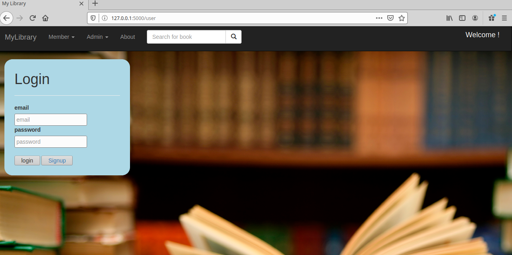
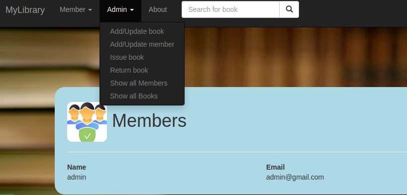
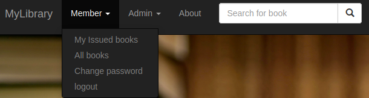
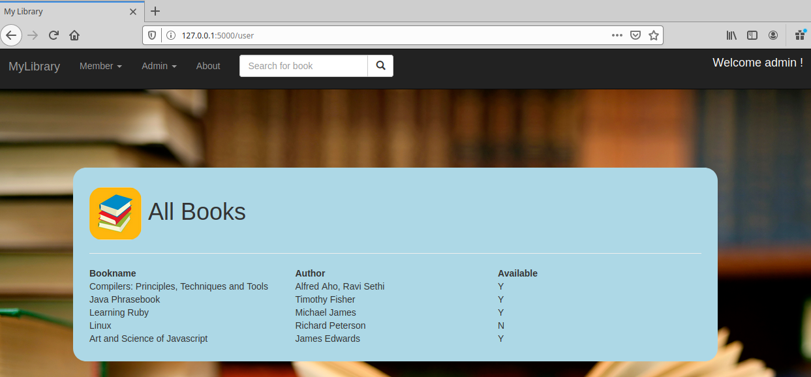
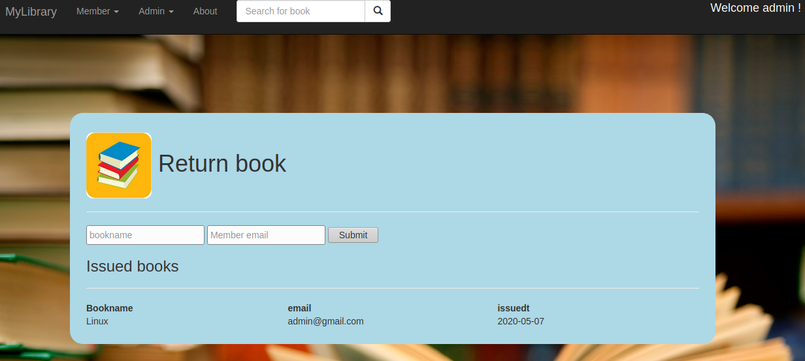

# mylibrary
Python Flask application for library management system features like:
1. User and admin management
2. Manage books and members additions and updates

Requirements:
1. Python 3.7 or up
2. sqllite3
3. flask
4. SqlAlchemy

Installation:
pip install flask
pip install sqlalchemy

Getting Started:
git clone https://github.com/iduryodhanrao/mylibrary.git
cd mylibrary
python app_run.py

go to http://127.0.0.1:5000/ in your browser

Default admin credentials: 
email: admin@gmail.com
password: admin

